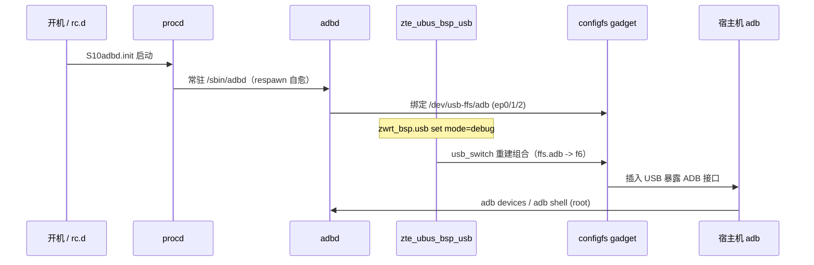

# ADB 控制与启动机制

> **验证说明**：本文基于对 `adbd.init`、`zte_ubus_bsp_usb`、`/sbin/start_usb`、`/sbin/usb/compositions/usb_switch` 等脚本的静态分析，以及在设备上的只读检查（configfs、`ubus call zwrt_bsp.usb list`、`/tmp/usb.log`、进程与挂载信息）。`zwrt_bsp.usb set mode=debug` 会切换 USB 组合，属写操作，**尚未在设备上执行**；写操作须先行备份并自行确认副作用。

U60 Pro 的 ADB 由 `adbd` 与 USB functionfs gadget 协同实现。设备默认不开放 ADB，而是通过 ZTE 私有 ubus 接口 `zwrt_bsp.usb` 动态切换 USB composition 来启用或关闭。

- `adbd` 进程始终在后台常驻；
- 只有当 configfs gadget 组合中包含 `ffs.adb` 时，插入 USB 才会暴露 ADB 设备。

## 一、相关程序

| 文件 | 说明 |
|---|---|
| `/sbin/adbd` | ADB 守护进程，aarch64/musl 动态链接 |
| `/etc/init.d/adbd.init` | `adbd` 的 procd 启动脚本，`START=10`，常驻并崩溃自动重启 |
| `/usr/bin/zte_ubus_bsp_usb` | USB 控制守护进程，注册 ubus 对象 `zwrt_bsp.usb` |
| `/etc/init.d/zte_ubus_bsp_usb.init` | USB 控制守护的 procd 启动脚本，`START=01` |
| `/sbin/start_usb` | USB 初始化脚本，`usb.init` 调用，负责初始化 configfs gadget 与 functionfs |
| `/sbin/usb/compositions/usb_switch` | USB composition 切换脚本，重建 configfs gadget 组合 |
| `/sbin/launch_adbd` | QC 遗留辅助脚本，负责启动 `adbd`（当前基本不再依赖它） |

## 二、硬件接口

- USB 控制器：`a600000.dwc3`（Qualcomm DWC3，挂在 `a600000.ssusb` 下，role 可切 host/peripheral）
- gadget 配置：`/sys/kernel/config/usb_gadget/g1`（configfs）
- ADB functionfs：`/dev/usb-ffs/adb`，由 `adbd` 绑定并持有 ep0/ep1/ep2 端点
- functionfs 挂载：`mount -o uid=2000,gid=2000 -t functionfs adb /dev/usb-ffs/adb`，ep0/1/2 由 `adb` 用户持有
- 角色（host/device）与 ADB 暴露存在互斥关系，详见 [usb-otg-host.md](usb-otg-host.md)

## 三、工作原理

### 3.1 `adbd` 常驻

`/etc/init.d/adbd.init` 用 procd 以 `/sbin/adbd` 启动守护进程，崩溃时由 procd 的 respawn 参数自动重启。

`adbd` 启动时打开并绑定 `/dev/usb-ffs/adb` 下的 functionfs 端点；在设备上检查时，其 fd 即持有 ep0/ep1/ep2。

### 3.2 USB 组合决定是否暴露 ADB

`adbd` 进程一直在运行，但只有当 configfs gadget 组合里含 `functions/ffs.adb` 并软链到 `configs/c.1/f6` 时，插入 USB 才会出现 ADB 接口。

### 3.3 控制入口 `zwrt_bsp.usb`

`zte_ubus_bsp_usb` 注册该 ubus 对象，提供 `list` 与 `set{mode}` 两个方法。

- 调用 `zwrt_bsp.usb set mode=debug` 即启用调试（含 ADB）；
- 其余 mode（如存储、ECM 上网）不含 ADB。

### 3.4 组合切换

收到 `set mode=debug` 后，`zte_ubus_bsp_usb` 构造并执行：

```sh
sh /sbin/usb/compositions/usb_switch <vid> <pid> <functions> <serial>
```

`usb_switch` 做以下几件事：

1. 重置 `configs/c.1/f*`；
2. 改写 VID/PID 与厂商字符串；
3. 按 `*ffs*` 关键词把 `functions/ffs.adb` 软链到 `f6`；
4. 最后回写 UDC 完成绑定。

`usb_switch` 写入品牌串 `"ZTE,Incorporated"` / `"ZTE Mobile Broadband"`，并配置 MSFT os_desc（`b_vendor_code=0x04`、`qw_sign=MSFT100`、`os_desc/use=1`）。

`/sbin/usb/compositions/` 下有大量按 VID/PID 命名的遗留组合脚本（`901*` / `90*` / `91*` 等），`usb_switch` 是当前生效的统一入口。

### 3.5 `launch_adbd` 与 `from_adb`

QC 遗留的组合脚本（如 `901D`、`90DB`）中存在基于 `from_adb` 参数重启 `adbd` 的逻辑。当前固件实际使用的 `usb_switch` 并不处理 `from_adb`：

- 脚本内未对该变量赋值，默认为空串；
- 因此该 if 分支不会命中，**不会**主动 `pkill adbd` 或调用 `launch_adbd`。

当前 `adbd` 的生命周期由 `adbd.init`（procd）统一管理，USB 组合切换时并不重启它。

此外，`launch_adbd` 所引用的 `/etc/launch_adbd`、`/etc/default/adbd` 在当前系统也不存在，属于未启用 / 失效的遗留路径。

### 3.6 事件来源

`zte_ubus_bsp_usb` 通过 libnl-genl 接收内核上报的 USB 事件（vid/pid/functions/serialno），并处理 `zwrt_device_power_state_event` 等设备状态事件来动态调整 USB mode。

## 四、开机启动序列

`rc.d` 中与 USB/ADB 相关的启动点（按执行顺序）：

| rc.d 链接 | init 脚本 | 作用 |
|---|---|---|
| `S01zte_ubus_bsp_usb.init` | `zte_ubus_bsp_usb.init` | 启动 `zte_ubus_bsp_usb`，注册 `zwrt_bsp.usb`（START=01） |
| `S04usb.init` | `usb.init`→`/sbin/start_usb init` | 初始化 configfs gadget 与 functionfs、绑定 UDC、设默认（无 ADB）组合 |
| `S10adbd.init` | `adbd.init`（procd） | 启动 `/sbin/adbd`，绑定 functionfs 端点 |

整体流程：

1. procd 启动 `zte_ubus_bsp_usb`，USB 控制对象就绪。
2. `start_usb init` 创建 configfs gadget，组装默认组合（通常为 `mass_storage`，随后升级为 `ecm_gsi,mass_storage`），**不含 `ffs.adb`**，USB 不暴露 ADB。
3. `adbd.init` 把 `/sbin/adbd` 常驻后台。
4. （可选）调用 `zwrt_bsp.usb set mode=debug`。
5. `zte_ubus_bsp_usb` 执行 `usb_switch` 切换到含 `ffs.adb` 的调试组合。
6. `usb_switch` 重建组合，把 `functions/ffs.adb` 软链到 `configs/c.1/f6`，回写 UDC 完成绑定。
7. 插入 USB 后，宿主机 `adb devices` 即可识别设备，`adb shell` 获得 root 权限。

`start_usb init` 在建 gadget 时还会：

- `mkdir functions/ffs.adb`；
- 挂载 functionfs；
- 写 `strings/0x409/serialnumber`。

`serialnumber` 实际取自 `/etc/adb_devid`（`start_usb` 内 `cat /etc/adb_devid > strings/0x409/serialnumber`），非固定串。

机制可概括为：procd 常驻 `adbd`，配合 `zwrt_bsp.usb set mode=debug` 触发 `usb_switch`，把 configfs gadget 组合切到含 `ffs.adb` 的调试组合。ADB 进程由 `adbd.init`（S10）在开机时启动并常驻；USB 组合切换时 `usb_switch` 仅重建 gadget 组合，并不重启 `adbd`。因此 ADB 仅在需要时才暴露。

## 五、组合切换记录

设备 `/tmp/usb.log`（`usb_switch` 日志）记录了开机默认组合到调试组合的切换：

```
2025-01-04 00:00:10 LOG: 0x19d2 0x1225 mass_storage ...            # 开机，仅存储，无ADB
2025-01-04 00:00:12 LOG: 0x19d2 0x1405 ecm_gsi,mass_storage ...    # 升级，仍无ADB
2026-08-07 16:49:21 LOG: 0x19d2 0x1404 rndis_gsi,diag,serial,modem,mass_storage,ffs,dpl,qdss ...
```

默认组合演进：`mass_storage` → `ecm_gsi,mass_storage` →（debug）`rndis_gsi,diag,serial,modem,mass_storage,ffs,dpl,qdss`。

最后一次组合含 `ffs`（即 ADB）。在设备上检查时，`configs/c.1/f6 -> ../functions/ffs.adb` 已生效，`adbd` 以 root 由 procd 托管，`adb devices` 可识别该设备（序列号取自 `/etc/adb_devid`，形如 `MU5120ZTED…`）。

## 六、开启与关闭 ADB

### 6.1 经 Web / HTTP-ubus 开启

仓库内 `files/enable_debugging.sh` 为经网页开启 ADB 的完整实现，在设备 `192.168.0.1` 上通过 HTTP `/ubus/` 调用：

1. 取 `zte_web_sault`（`zwrt_web web_login_info`）；
2. 用 `sha256(sha256(pass).upper()+salt).upper()` 登录得 `ubus_rpc_session`；
3. 调 `zwrt_bsp.usb set {"mode":"debug"}`。

该方式无需 SSH，只需持 admin 密码即可在局域网内开启 ADB；`README.md` 引用的
[MlgmXyysd/openadb_MU5250](https://github.com/MlgmXyysd/openadb_MU5250) 本质也是同一个 ubus 调用。

### 6.2 在设备上经 SSH 开启

已获得 root 后，直接调用 ubus 即可（与网页方式等价，仅省去登录步骤）：

```sh
ubus call zwrt_bsp.usb set '{"mode":"debug"}'
```

### 6.3 确认是否已暴露 ADB

只读核对三点：

```sh
# 1) 当前 mode（应含 debug / connect=1）
ubus call zwrt_bsp.usb list
# 2) gadget 组合中 f6 是否指向 ffs.adb
ls -l /sys/kernel/config/usb_gadget/g1/configs/c.1/f6
# 3) 宿主机侧是否识别到设备
adb devices
```

`set mode=debug` 会触发 `usb_switch` 重建组合。最终 `configs/c.1/f6 -> ../functions/ffs.adb` 生效时，插上 USB 才是 ADB 接口；`adbd` 本身常驻，不需要单独启动。

### 6.4 关闭 ADB

`zte_ubus_bsp_usb` 的 mode 字面量中，`debug` 是含 ADB 的组合；**未内置 `storage` 字面量**，其它不含 ADB 的组合由模式 / 电源事件驱动（可参考 [usb-otg-host.md](usb-otg-host.md) 的 host 切换）。关闭 ADB 的稳妥做法是：把 `mode` 切回非 debug 组合（例如回到默认 / 存储组合），或仅断开 USB，避免长时间停留在调试口。

> ⚠️ **写操作提醒**：`set mode=debug` 会切换 USB 组合、可能临时断连，属写操作。本文验证过程中**未执行**该写操作，只做了只读检查。

## 七、开机自启 ADB（配合 init.sh）

`README.md` 的「ssh 持久化及开机启动 adb」一节即本机制的应用：把仓库 `files/init.sh` 复制到 `/data/init.sh`，`rc.local` 在 `exit 0` 前执行 `sh /data/init.sh`。其中 `/data/enable_debugging.sh` 在 web 起来后 `sleep 10` 再运行，即开机后自动 `set mode=debug`。

## 八、排障检查链

若宿主机能插入 USB 但 `adb devices` 看不到设备，按顺序排查：

1. `ubus call zwrt_bsp.usb list` —— `mode` 是否为 `debug`、`connect` 是否为 1；
2. `ls -l /sys/kernel/config/usb_gadget/g1/configs/c.1/f6` —— 是否指向 `ffs.adb`，且组合里确有 `ffs.adb`；
3. `cat /sys/kernel/config/usb_gadget/g1/UDC` 与 `ls /sys/class/udc/` —— UDC 是否绑定（应为 `a600000.dwc3`）；
4. `ps w | grep adbd` —— `adbd` 是否仍在（procd 托管，崩溃会自动重启；多见 USB 组合已切到非 debug，而非进程退出）；
5. `tail /tmp/usb.log` —— 看最近一次组合切换是否含 `ffs`；
6. 换 USB 口 / 重插线，宿主机 `adb kill-server && adb devices` 重连。

procd 的 `respawn`（3600/5/10）意味着 `adbd` 崩溃会**自动重启**。「ADB 突然不可用」多半是 USB 组合已切到非 debug，而不是进程退出。

## 九、安全注意事项

`set mode=debug` 后，`adb shell` 得到的是**无认证的 root shell**：

- `files/enable_debugging.sh` 开启 ADB 所用的正是 `zwrt_bsp.usb set mode=debug`。进入 debug 模式后，`adb shell` 拿到 root 即可读取 web 登录所需的盐与凭据（脚本里的 `zte_web_sault` 流程依赖管理员密码），并可直接下发 `zwrt_bsp.usb` 命令。调试口等同于持有管理员密码后的完整控制通道；
- 因此使用完应尽快切回非 debug 组合或拔出 USB，不要把设备长时间留在 USB 调试口；
- 如需远程维护可改用 SSH（见 `README.md`），并用强密码替换 `enable_debugging.sh` 里的 `PASSWORD` 占位符。

## 流程示意



## 相关文档

- [usb-otg-host.md](usb-otg-host.md) — USB 角色（host/device）与 ADB 互斥
- [webui-trace.md](webui-trace.md) — HTTP `/ubus/` 登录与 `zwrt_bsp.usb`
- [README.md](../README.md) — 开启 ADB / SSH 与 `init.sh` 开机自启
