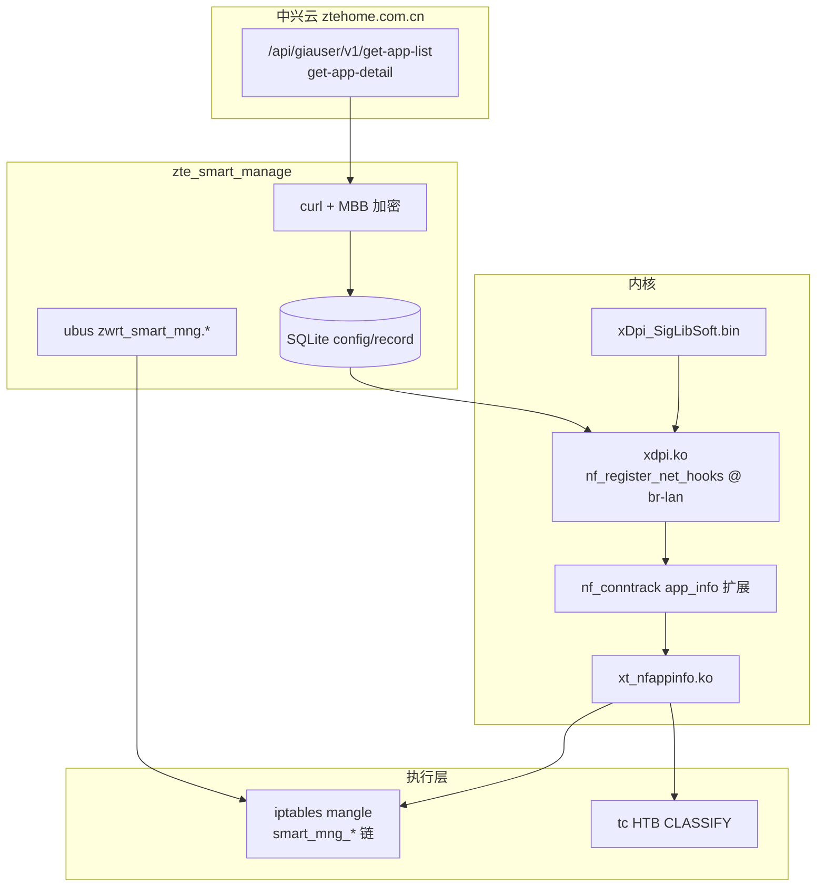

# 智能管理（`zte_smart_manage` + xDPI）

> **验证说明**：本文基于 `playground/full_disk_bkp.img`（整盘备份）中 **system 分区（p59）** 与 **ai_app 分区（p66）** 的静态 carving / strings 分析。未在设备上执行写操作。分析产物位于 `playground/smart_manage_analysis/`、`playground/xdpi_analysis/`（均已列入 `.gitignore`，不纳入版本库）。`uci set` / `rmmod` / 停进程等写操作须先行备份并自行确认副作用。

## 一、功能范围

`zte_smart_manage` 是中兴 **「智能管理 / 家长管控 + 应用识别 + 智能 QoS」** 的核心守护进程，除遥测上报外，还在本地完成：

- **DPI 应用识别**（内核 `xdpi.ko` + 165MB 特征库）
- **按 MAC 的上网管控**（iptables `smart_mng_*` 链）
- **用量统计**（nf_conntrack + SQLite）
- **Ai_mode QoS**（`xt_nfappinfo` + tc CLASSIFY）

并定期从 **中兴云（`ztehome.com.cn`）** 拉取应用分类库，把 DPI 输出的数字 ID 映射为可读 App 名。

`files/init.sh` 将其与 MQTT/FOTA 等一并视为 calling home 服务并禁用。停进程后 procd 可能 respawn，需配合 UCI 关闭。

## 二、组件架构

| 组件 | 路径 | 说明 |
|------|------|------|
| 主进程 | `/usr/bin/zte_smart_manage` | procd 托管，`START=49`，`respawn` |
| 核心库 | `libzte_smart_manage` | SQLite 配置/记录、策略逻辑 |
| 内核 DPI | `/lib/modules/xdpi.ko` | 约 **20MB**，主识别引擎 |
| iptables 扩展 | `/lib/modules/xt_nfappinfo.ko` | 约 **484KB**，读取 conntrack 中的 app 信息 |
| 特征库 | `/ai_app/xDpi_SigLibSoft.bin` | 约 **165MB**，`ai_app` 分区 ext4 |
| Shell 脚本 | `/sbin/smart_manage_deal.sh` | 维护 iptables 管控链 |
| QoS 协调 | `/sbin/smart_set_qos_policy.sh` | 与其它限速策略的优先级协调 |
| Web 桥接 | `access_smart_manage.c`（`libzte_web`） | Web UI 调 ubus |
| 配置 | UCI `zwrt_smart_mng` | 见 [uci-config.md](uci-config.md) §二十 |



### procd 启动脚本

从 system 分区提取的 `/etc/init.d/zte_smart_manage`：

```sh
#!/bin/sh /etc/rc.common
START=49
STOP=99
USE_PROCD=1
_BIN=/usr/bin/zte_smart_manage

start_service() {
    procd_open_instance
    procd_set_param command $_BIN
    procd_set_param respawn
    procd_close_instance
}
```

## 三、`zte_smart_manage` 功能

### 3.1 云端应用库同步

| 项 | 值 |
|----|-----|
| 服务器 | `https://rot-dispatch-link.ztehome.com.cn:30443`（UCI `app_server_url` / `app_server_port`） |
| API | `/api/giauser/v1/get-app-list`、`/api/giauser/v1/get-app-detail` |
| 传输 | libcurl + MBB 加密（`MBB_cipher_init` / `MBB_decryption`） |
| 证书 | `/etc/smng/ca.crt`、`cloudserver.crt`、`cloudserver.key` |
| 本地缓存 | `/ai_data/config/appList.json`、`appInfo.json` 等 |

后台线程 `zte_smart_mng_update_srv_thread` 定时拉取/更新应用库；UCI `dev_update_srv_time`、`dev_clear_info_time` 记录同步节奏。

### 3.2 按 MAC 的家长管控

`/sbin/smart_manage_deal.sh` 在 **iptables/ip6tables mangle** 表维护以下自定义链：

| 链名 | 作用 |
|------|------|
| `smart_mng_cutoff` | 按 MAC **完全断网**（DROP） |
| `smart_mng_app_filter` | 按 **appid/apptype** 禁特定 App（`-m nfappinfo`） |
| `smart_mng_time_ctl` | **时段管控**（`time` 模块，窗口外 DROP） |
| `smart_mng_times_ctl` | **奖励时长 / 额外可用时间** |
| `smart_mng_domain_filter` | **域名/URL 过滤** |
| `smart_mng_defective_filter` | 「不良内容」过滤 |

SQLite 策略表（strings 还原）：

```sql
-- 每终端管控策略
CREATE TABLE user_config_info_table (
  mac_address char(20),
  child_group_switch INTEGER,
  cutoff_flag char(32),
  app_filter char(8192),
  time_manage char(512),
  url_filter char(640),
  allowed_time char(64),
  reward_time INTEGER,
  appfilter_by_all_or_type char(32),
  all_func_allowed INTEGER DEFAULT 0,
  cutoff_time INTEGER DEFAULT 0,
  defective INTEGER DEFAULT 0
);

-- 终端映射 + 用量
CREATE TABLE user_mapping_table (
  mac_address char(20),
  ip_address char(20),
  hostname char(64),
  used_time INTEGER DEFAULT 0,
  start_time INTEGER DEFAULT 0,
  Qos_action char(20),
  behavior_identify char(64),
  func_setted_flag INTEGER DEFAULT 0,
  yesterday_used_time INTEGER DEFAULT 0
);
```

ubus 对象 `zwrt_smart_mng.api` / `zwrt_smart_mng.msg` 暴露大量 get/set API，例如：`smart_mng_cutoff_set/get`、`smart_mng_app_filter_set/get`、`smart_mng_time_ctl_set/get`、`smart_mng_domain_filter_set/get`、`smart_mng_defective_set/get`、`smart_mng_game_session_switch` 等（SDK 枚举见 [ipc-protocol.md](ipc-protocol.md) §三）。

### 3.3 智能 QoS（Ai_mode）

- UCI：`zwrt_smart_mng.smart_qos.mode='Ai_mode'`
- 通过 **mangle + nfappinfo + CLASSIFY** 给不同 apptype 分配 tc class
- QoS 优先级（`smart_set_qos_policy.sh`）：

  ```
  省电模式 > 实通 SIM 限速 > 用户总限速 > zte_smart_manage QoS
  ```

- `acc_effect_enable=1`（UCI）控制加速/QoS 效果是否生效；`files/init.sh` 将其置 `0` 是从源头关闭

### 3.4 本地统计

- 读 `/proc/net/nf_conntrack` 中带 `app_info=` 的条目，结合 `/proc/net/arp` 映射 IP→MAC
- 按 MAC 统计日/周在线时长、各 App 累计/会话时长
- 游戏会话采集（`game_session_enable`）写 `/tmp/xdpi_game_info.txt`
- 跨天清零经内部 pipe 消息 `SMART_MNG_PIPE_DEAL_NEW_DAY` 触发

## 四、xDPI 应用识别

识别在**内核**完成；**云端/SQLite** 负责把 DPI 数字 ID 映射为可读 App 名；**iptables** 消费识别结果。

### 4.1 三层分工

```
SigLib 命中 → CFID/appid（内核数字）
           → ctlIds（SQLite，云端维护）
           → appUuid + appName（UI 展示）
```

### 4.2 `xdpi.ko` — 主 DPI 引擎

| 属性 | 值 |
|------|-----|
| 描述 | `app filter module` |
| 作者 | `ZTE MBB` |
| 内核 | `5.15.167-perf` aarch64 |
| 大小 | 约 **20MB**（含完整 xDPI 引擎与 debug_info） |
| 模块参数 | `xdpi_landev`（char*，通常 `br-lan`）、`xdpi_capacity`（char*，UCI 配置） |
| Hook | `nf_register_net_hooks`，监听 `xdpi_landev` 指定网桥 |

**加载**（`zte_smart_manage`）：

```sh
insmod /lib/modules/xt_nfappinfo.ko
insmod /lib/modules/xdpi.ko xdpi_landev=br-lan xdpi_capacity=<UCI xdpi_capacity>
```

**初始化流程**（`[XDPI]` 日志字符串）：

1. `xDPIPowerOn` / `xDPISoftInit` / `xDPIInit` — vmalloc 内存池
2. `mp_LoadSigLibInfo` — 加载 `/ai_app/xDpi_SigLibSoft.bin`
3. `xDPILoadRule` — 解析 AC 自动机、状态机、L2 规则等
4. `xdpi_load_appid_type_buf_from_file` — 读 `/tmp/smart_mng_appid_type`
5. `nf_register_net_hooks` — 挂 hook

**包处理管线**（源码路径 / 函数字符串推断）：

```
skb 进入 hook
  → 建/查 flow context（五元组）
  → pre-filter（PreFilterEntry）
  → classifier 链（mp_scanpkt / xdpi_scanpkt）
      命中 SigLib → CFID（Classifier ID）
  → 协议解码：HTTP / DNS / QUIC+TLS / MQTT / RTP / H.264 / …
  → 更新 app context
  → 写 nf_conntrack 扩展 app_info（app_id[] + app_type[]）
```

### 4.3 `xt_nfappinfo.ko` — iptables 匹配扩展

| 属性 | 值 |
|------|-----|
| 描述 | `Xtables: match for the extended appinfo` |
| 源码路径 | `xt_nfappinfo-1.0/src/xt_nfappinfo.c` |
| 别名 | `ipt_nfappinfo` / `ip6t_nfappinfo` |

从 `nfappinfo_mt` 反汇编可见两种匹配模式：

| match 类型 | iptables 参数 | conntrack 扩展数据来源 |
|-----------|---------------|------------------------|
| `0` | `--appid <id>` | 扩展区 +0x20 的 app_id 列表 |
| `1` | `--apptype <type>` | 扩展区 +0x28 的 app_type 列表 |

**家长管控示例**：

```sh
iptables -t mangle -A smart_mng_app_filter \
  -m mac --mac-source $mac -m nfappinfo --appid $id -j DROP
iptables -t mangle -A smart_mng_app_filter \
  -m mac --mac-source $mac -m nfappinfo --apptype $type -j DROP
```

**QoS 示例**（Ai_mode，apptype 为大类而非精确 App）：

```sh
iptables -t mangle -A $SMART_QOS_CHAIN -o $wan \
  -m nfappinfo --apptype 2 -j CLASSIFY --set-class 1:30
iptables -t mangle -A $SMART_QOS_CHAIN -o $wan \
  -m nfappinfo --apptype "4;6" -j CLASSIFY --set-class 1:10
```

### 4.4 特征库 `xDpi_SigLibSoft.bin`

| 属性 | 值 |
|------|-----|
| 路径 | `/ai_app/xDpi_SigLibSoft.bin`（`ai_app` 分区 mmcblk0p66，400MB ext4） |
| 大小 | 约 **165MB**（173 416 449 字节） |
| 魔数 | `xDPISignatureProduct` |
| 加载 | `mp_LoadSigLibInfo` |

内容为二进制编码规则库，含大量 `MULTI_FILTER_*` 命名规则，针对国内常见 App/协议，例如：

| 规则名 | 推测目标 |
|--------|----------|
| `MULTI_FILTER_DOUYIN_CDN` | 抖音 CDN |
| `MULTI_FILTER_YOUKU_*` | 优酷 |
| `MULTI_FILTER_XIGUASHIPIN` | 西瓜视频 |
| `MULTI_FILTER_JINRITOUTIAO_*` | 今日头条 |
| `MULTI_FILTER_XMPP` / `SIP` / `VOLTE` | 即时通讯 / VoIP |

规则体含 URL/host/协议特征片段（如 `"http://`、`"monaAddr":`、`"t":` 等），由 AC 自动机（`mp_load_ac`）、状态机（`mp_load_nxtstate`）、WM 匹配（`mp_load_wm`）等结构加载，`mp_decode_rule` 解码。

镜像中可见约 **47** 条 distinct `MULTI_FILTER_*` 名字符串；完整库体积 165MB，实际规则远多于此。

### 4.5 App 映射：CFID → 可读名称

DPI 输出 **CFID/appid**（内核数字），可读 App 名来自云端 + SQLite：

**云端 API** 同步到 `applist_info_table`：

```sql
CREATE TABLE applist_info_table (
  appUuid char(40),    -- 云端 UUID
  ctlType char(20),
  appIcon char(256),
  appName char(64),    -- 「抖音」「优酷」等
  appType INTEGER,
  appDesc char(128),
  ctlIds char(512),    -- ★ 对应 xDPI CFID/appid，可多值，分号分隔
  version char(64)
);
```

查询示例（strings 还原）：

```sql
SELECT * FROM applist_info_table
 WHERE ctlIds = '%s'
    OR ctlIds LIKE '%;%s;%%'
    OR ctlIds LIKE '%;%s'
    OR ctlIds LIKE '%s;%%';
```

**/tmp/smart_mng_appid_type**：xdpi 启动时加载，维护 **appid → AppType/TC_Type** 映射；用户态经 `xdpi_get_appType_by_appid`、`libzte_smart_manage_check_acc_by_tc_type` 做 QoS/加速判断。

**运行时读取**：

```sh
cat /proc/net/nf_conntrack | grep app_info
# 统计某 MAC 某 appid 连接数：
cat ... | grep -E 'tcp.*ESTABLISHED|udp' | grep app_info=<id> | grep -i <mac_fragment> | wc -l
```

### 4.6 AppType 大类（QoS 维度）

`-m nfappinfo --apptype` 使用的是**流量大类**，不是精确 App 名。从 QoS iptables 规则推断：

| AppType | 推测含义 | QoS 处理 |
|---------|----------|----------|
| `1` | 视频/流媒体 | 下载较高优先级 class 1:10~1:20 |
| `2` | 游戏/实时交互 | 上下行不同 class（1:30 / 1:11） |
| `4;6` | 背景/P2P/低优先级 | class 1:10 / 1:22 |

精确到「哪个 App」靠 **appid + ctlIds**；AppType 供 QoS/大类管控使用。

## 五、UCI 配置要点

完整条目见 [uci-config.md](uci-config.md) §二十。关键字段：

```sh
uci show zwrt_smart_mng
# zwrt_smart_mng.smart_mng.app_server_url='https://rot-dispatch-link.ztehome.com.cn'
# zwrt_smart_mng.smart_mng.app_server_port='30443'
# zwrt_smart_mng.smart_mng.app_vendor_type='MBB_general'
# zwrt_smart_mng.smart_mng.xdpi_support='1'
# zwrt_smart_mng.smart_mng.acc_effect_enable='1'    # 加速/QoS 效果总开关
# zwrt_smart_mng.smart_mng.game_session_enable='…'
# zwrt_smart_mng.smart_qos.mode='Ai_mode'
```

**密钥类字段**（`app_clientkey_password` 等）不得写入公开文档。

## 六、禁用与影响

> **禁用（写操作，本文未在设备上执行）**：下列命令会改变设备状态；部署前须备份并确认副作用。`files/init.sh` 中的处理：

```sh
/etc/init.d/zte_smart_manage stop
killall -q zte_smart_manage
uci set zwrt_smart_mng.smart_mng.acc_effect_enable=0
uci commit zwrt_smart_mng
```

| 操作 | 影响 |
|------|------|
| stop + killall | 停主进程；procd 可能 respawn，需配合 UCI |
| `acc_effect_enable=0` | 关闭加速/QoS 效果开关 |
| 完整禁用 + `rmmod xdpi` | 家长管控、DPI 识别、Ai_mode QoS、云端 App 库更新均失效 |
| 普通路由 | **不受影响**；`zwrt_router.qos` 用户总限速仍可用 |

停掉后 Web UI 中「智能管理 / 儿童上网 / 应用管控 / AI 加速」类功能会不可用或报错。

## 七、静态分析产物

从 `playground/full_disk_bkp.img` 提取，位于 `.gitignore` 的 `playground/` 下：

| 路径 | 说明 |
|------|------|
| `playground/smart_manage_analysis/system.img` | system 分区（p59，800MB） |
| `playground/smart_manage_analysis/zte_smart_manage` | 主二进制 carve |
| `playground/smart_manage_analysis/zte_smart_manage.init` | procd init 脚本 |
| `playground/smart_manage_analysis/smart_set_qos_policy.sh` | QoS 优先级脚本 |
| `playground/xdpi_analysis/xdpi.ko` | DPI 内核模块（~20MB） |
| `playground/xdpi_analysis/xt_nfappinfo.ko` | iptables match（~484KB，含 debug_info） |
| `playground/xdpi_analysis/xDpi_SigLibSoft.bin` | 特征库（~165MB） |
| `playground/xdpi_analysis/ai_app.img` | ai_app 分区（p66，400MB） |

复现提取可参考：GPT 分区表见 [partitions.md](partitions.md)；system p59 起始偏移 **2 759 852 032** 字节；ai_app p66 起始 **4 787 798 016** 字节；SigLib 文件内容在 ai_app 镜像内偏移 **39 847 200** 处（魔数 `xDPISignatureProduct`）。

## 八、相关文档

- [uci-config.md](uci-config.md) — `zwrt_smart_mng` / 遥测上报 §二十
- [ipc-protocol.md](ipc-protocol.md) — `zwrt_smart_mng.api` ubus 对象面
- [partitions.md](partitions.md) — `system` / `ai_app` / `userdata` 分区
- [files/init.sh](../files/init.sh) — calling home 禁用（含本服务）
- [wifi.md](wifi.md) — 同 procd START=49 的 `zte_topsw_wlan` 体系
